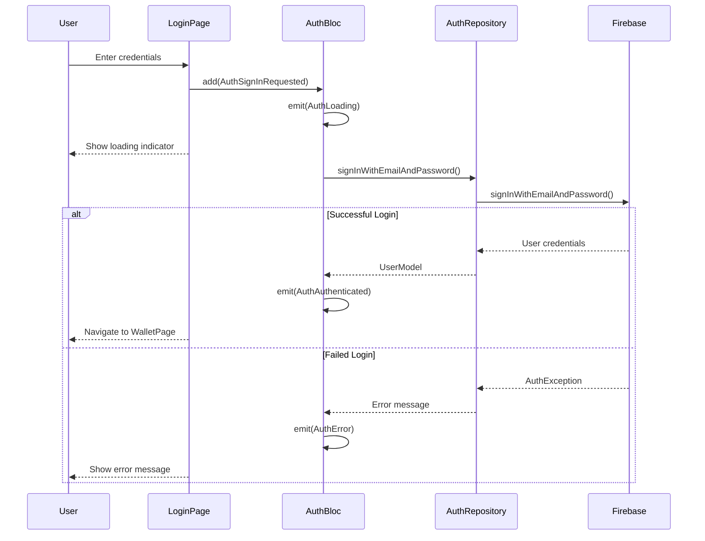
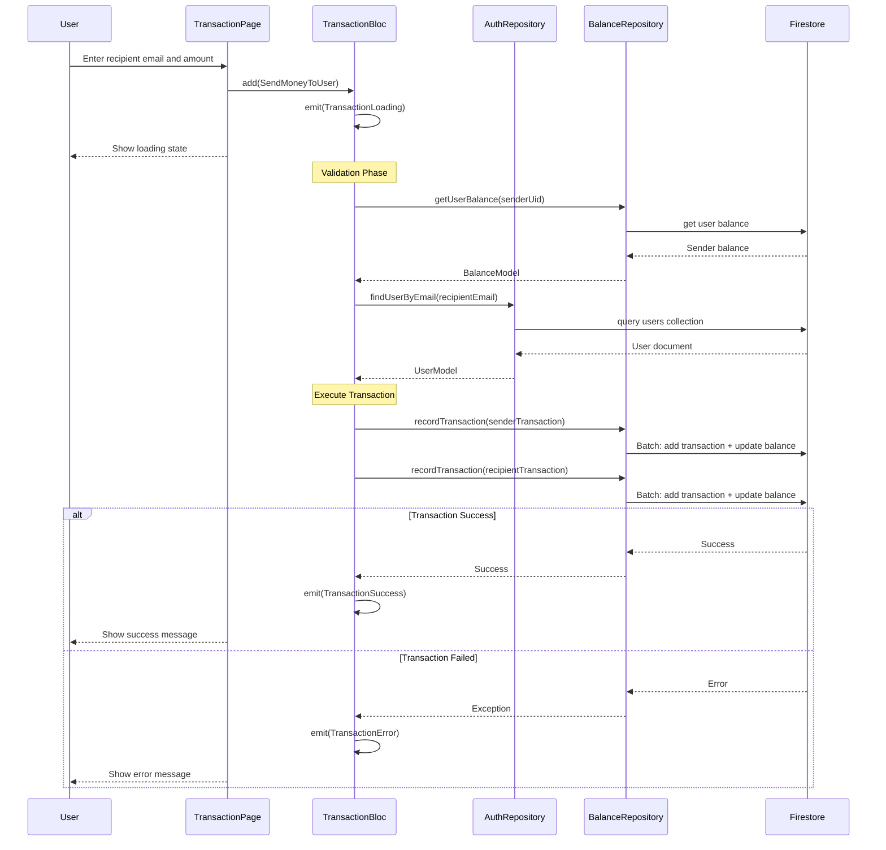
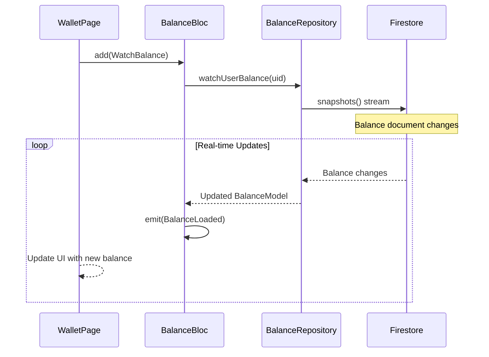

# Maya Exam - Design Documentation

## Overview

Maya Exam is a Flutter wallet application built with **Clean Architecture** and **BLoC pattern** for state management.

### Architecture Layers
- **UI Layer**: Flutter pages and widgets
- **BLoC Layer**: State management with AuthBloc, BalanceBloc, TransactionBloc
- **Repository Layer**: Data access through interfaces
- **Service Layer**: Firebase integration

---

## Core Components

### Pages
- **LoginPage**: User authentication
- **WalletPage**: Balance display and navigation
- **TransactionPage**: Send money functionality
- **TransactionHistoryPage**: Transaction list

### State Management (BLoC)
- **AuthBloc**: Handles login/logout
- **BalanceBloc**: Manages user balance and real-time updates
- **TransactionBloc**: Processes money transfers and history

### Data Models
- **UserModel**: User information from Firebase Auth
- **BalanceModel**: User's current balance
- **TransactionModel**: Individual transaction records

### Repositories
- **AuthRepository**: Firebase Auth operations
- **BalanceRepository**: Firestore balance and transaction operations

---

## Key Features

### Authentication Flow
1. User enters credentials on LoginPage
2. AuthBloc validates with Firebase Auth
3. Router redirects to WalletPage on success

### Balance Management
1. Real-time balance updates using Firestore streams
2. Balance validation for transactions

### Money Transfer
1. Validate recipient email and amount
2. Check sender's sufficient balance
3. Create/update recipient balance if needed
4. Record transaction for both users
5. Update balances

### Real-time Updates
- Balance changes are streamed from Firestore
- UI automatically updates when balance changes
- No manual refresh needed

---

## Project Structure

```
lib/
├── bloc/                 # State management
│   ├── auth/
│   ├── balance/
│   └── transaction/
├── models/               # Data models
├── repository/           # Data access layer
├── services/             # Firebase and service locator
├── view/                 # UI components
│   └── pages/
├── widget/               # Reusable widgets
│   └── common/
└── utils/                # App strings and utilities
```

---

## Class Diagram

```mermaid
classDiagram
    %% UI Layer
    class LoginPage {
        +Widget build(BuildContext context)
        +_handleLogin()
    }
    
    class WalletPage {
        +Widget build(BuildContext context)
        +_refreshBalance()
    }
    
    class TransactionPage {
        +Widget build(BuildContext context)
        +_sendMoney()
    }
    
    class TransactionHistoryPage {
        +Widget build(BuildContext context)
        +_loadHistory()
    }

    %% BLoC Layer
    class AuthBloc {
        -AuthRepositoryInterface _authRepository
        +Stream~AuthState~ stream
        +AuthState state
        +add(AuthEvent event)
    }

    class BalanceBloc {
        -BalanceRepositoryInterface _balanceRepository
        +Stream~BalanceState~ stream
        +BalanceState state
        +add(BalanceEvent event)
    }

    class TransactionBloc {
        -AuthRepositoryInterface _authRepository
        -BalanceRepositoryInterface _balanceRepository
        +Stream~TransactionState~ stream
        +TransactionState state
        +add(TransactionEvent event)
    }

    %% Repository Layer
    class AuthRepositoryInterface {
        <<interface>>
        +Stream~User?~ authStateChanges
        +UserModel? getCurrentUser()
        +Future~UserModel?~ signInWithEmailAndPassword()
        +Future~void~ signOut()
        +Future~UserModel?~ findUserByEmail()
    }

    class AuthRepository {
        -FirebaseAuth _auth
        -FirebaseFirestore _firestore
        +Stream~User?~ authStateChanges
        +UserModel? getCurrentUser()
        +Future~UserModel?~ signInWithEmailAndPassword()
        +Future~void~ signOut()
        +Future~UserModel?~ findUserByEmail()
    }

    class BalanceRepositoryInterface {
        <<interface>>
        +Future~BalanceModel?~ getUserBalance()
        +Future~void~ updateUserBalance()
        +Future~void~ createUserBalance()
        +Stream~BalanceModel?~ watchUserBalance()
        +Future~void~ recordTransaction()
        +Future~List~TransactionModel~~ getUserTransactions()
    }

    class BalanceRepository {
        -FirebaseFirestore _firestore
        +Future~BalanceModel?~ getUserBalance()
        +Future~void~ updateUserBalance()
        +Future~void~ createUserBalance()
        +Stream~BalanceModel?~ watchUserBalance()
        +Future~void~ recordTransaction()
        +Future~List~TransactionModel~~ getUserTransactions()
    }

    %% Models
    class UserModel {
        +String uid
        +String? email
        +String? displayName
        +bool emailVerified
        +DateTime? createdAt
        +fromFirebaseUser()
        +fromJson()
        +toJson()
    }

    class BalanceModel {
        +String userId
        +double amount
        +DateTime lastUpdated
        +fromJson()
        +toJson()
    }

    class TransactionModel {
        +String id
        +String uid
        +double amount
        +TransactionType type
        +String description
        +DateTime timestamp
        +String? recipientUid
        +String? senderUid
        +fromJson()
        +toJson()
    }

    %% Relationships
    LoginPage --> AuthBloc
    WalletPage --> BalanceBloc
    TransactionPage --> TransactionBloc
    TransactionHistoryPage --> TransactionBloc
    
    AuthBloc --> AuthRepositoryInterface
    BalanceBloc --> BalanceRepositoryInterface
    TransactionBloc --> AuthRepositoryInterface
    TransactionBloc --> BalanceRepositoryInterface
    
    AuthRepository --|> AuthRepositoryInterface
    BalanceRepository --|> BalanceRepositoryInterface
    
    AuthRepository --> UserModel
    BalanceRepository --> BalanceModel
    BalanceRepository --> TransactionModel
```



---

## Sequence Diagrams

### Authentication Flow



### Money Transfer Flow



### Balance Real-time Updates Flow



---
